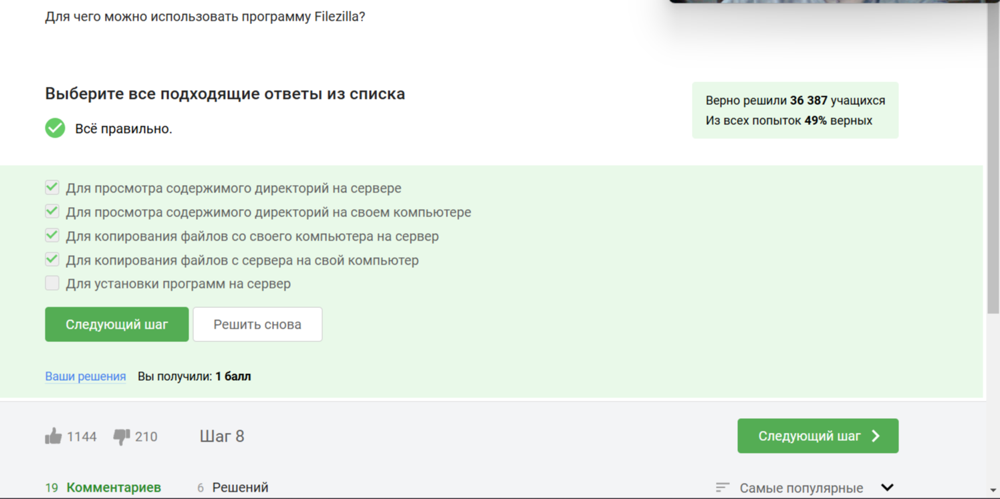
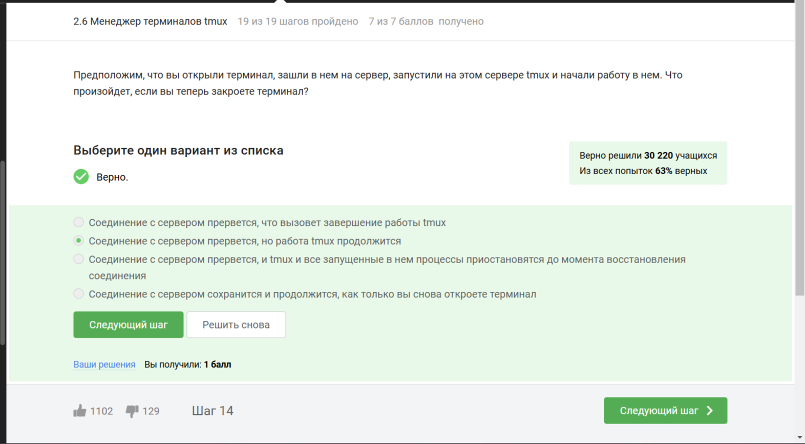

## Этап 2

Во втором этапе внешнего курса мне нужно было: познакомиться с сервером, рассмотреть обмен файлами, рассмотреть запуск приложений, рассмотреть контроль запускаемых приложений, познакомиться с многопоточными приложениями, познакомиться с Менеджером терминалов tmux и ответить на тестовые вопросы.

**После знакомства с сервером, мне нужно было ответить на следующие тестовые вопросы:**

# Задание 2.1.3

# Задание 2.1.6

**После просмотра обмена файлами, мне нужно было ответить на следующие тестовые вопросы:**

# Задание 2.2.4

# Задание 2.2.6

# Задание 2.2.8

**После просмотра запуска приложений, мне нужно было ответить на следующие тестовые вопросы:**

# Задание 2.3.4

# Задание 2.3.6

# Задание 2.3.7

# Задание 2.3.8

**После просмотра контроля запускаемых приложений, мне нужно было ответить на следующие тестовые вопросы:**

# Задание 2.4.5

# Задание 2.4.8

# Задание 2.4.10

# Задание 2.4.11

**После знакомства с многопоточными приложениями, мне нужно было ответить на следующие тестовые вопросы:**

# Задание 2.5.7

# Задание 2.5.8

# Задание 2.5.9

# Задание 2.5.12

# Задание 2.5.13

**После знакомства с Менеджером терминалов tmux, мне нужно было ответить на следующие тестовые вопросы:**

# Задание 2.6.5

# Задание 2.6.10

# Задание 2.6.14

# Задание 2.6.15

# Задание 2.6.18

# Задание 2.6.19

