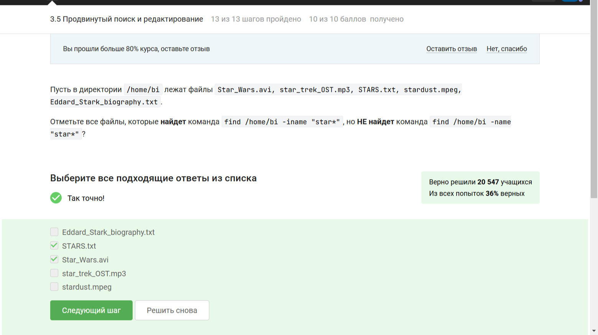
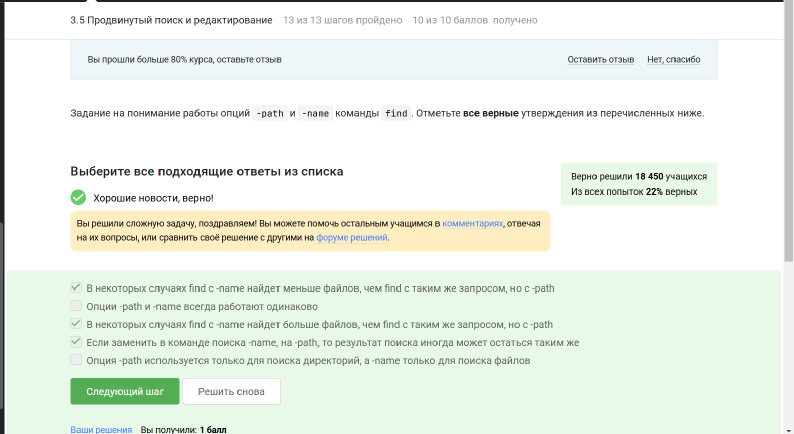

## Внешний курс раздел 3

В третьем этапе внешнего курса мне нужно было: познакомиться с Текстовым редактор vim, познакомиться с основами скриптов на bash, изучить скрипты на bash: ветвления и циклы, изучить скрипты на bash: разное, изучить продвинутый поиск и редактирование, изучить построение графиков в gnuplot, изучить пункт Разное и ответить на тестовые вопросы.

**После знакомства с Текстовым редактор vim, мне нужно было ответить на следующие тестовые вопросы:**

# Задание 3.1.5

# Задание 3.1.7

# Задание 3.1.8

# Задание 3.1.10

# Задание 3.1.11

**После знакомства с основами скриптов на bash, мне нужно было ответить на следующие тестовые вопросы:**

# Задание 3.2.3

# Задание 3.2.5

# Задание 3.2.7

# Задание 3.2.10

**После изучения скриптов на bash: ветвления и циклы, мне нужно было ответить на следующие тестовые вопросы:**

# Задание 3.3.3

# Задание 3.3.5

# Задание 3.3.6

# Задание 3.3.8

# Задание 3.3.9

**После изучения скриптов на bash: разное, мне нужно было ответить на следующие тестовые вопросы:**

# Задание 3.4.3

# Задание 3.4.5

# Задание 3.4.6

# Задание 3.4.8

# Задание 3.4.9

# Задание 3.4.10

**После изучения продвинутого поиска и редактирования, мне нужно было ответить на следующие тестовые вопросы:**

# Задание 3.5.3

# Задание 3.5.4

# Задание 3.5.5

# Задание 3.5.7

# Задание 3.5.9

# Задание 3.5.11

# Задание 3.5.12

**После изучения построения графиков в gnuplot, мне нужно было ответить на следующие тестовые вопросы:**

# Задание 3.6.3

# Задание 3.6.5

# Задание 3.6.7

# Задание 3.6.10

**После изучения пункта Разное, мне нужно было ответить на следующие тестовые вопросы:**

# Задание 3.7.4

# Задание 3.7.5

# Задание 3.7.7

# Задание 3.7.8

# Задание 3.7.10

## Итог

**Я закончила прохождение внешнего курса и получила сертификат с отличием**

## Вывод

Я познакомилась с операционной системой Linux и её базовыми возможностями. 